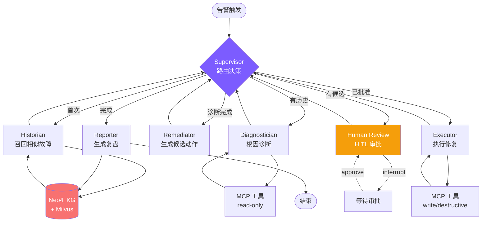

# SREwise — 自治式 SRE 智能体平台

> **会诊断、能修复、会学习的多 Agent 闭环 SRE 系统**
>
> 从告警触发到根因定位、从人工审批到自动修复、从事后复盘到知识沉淀 — 完整的 SRE 自动化闭环。基于 LangGraph 多 Agent 编排 + Neo4j 故障知识图谱 + Human-in-the-Loop 审批 + Langfuse 全链路可观测，让 AI Agent 真正参与生产运维。

[](https://www.python.org/)
[](https://fastapi.tiangolo.com/)
[](https://langchain-ai.github.io/langgraph/)
[](https://modelcontextprotocol.io/)
[](https://neo4j.com/)
[](https://langfuse.com/)

---

## 📖 目录

- [核心特性](#-核心特性)
- [系统架构](#️-系统架构)
- [快速开始](#-快速开始)
- [功能演示](#-功能演示)
- [技术亮点](#-技术亮点)
- [API 文档](#-api-文档)
- [开发指南](#-开发指南)
- [常见问题](#-常见问题)

---

## 🎯 核心特性

| 特性 | 说明 | 技术实现 |
|------|------|----------|
| **🤖 多 Agent 协作** | Supervisor 动态调度 5 个专业 Agent，分工明确互不干扰 | LangGraph StateGraph + LLM Router |
| **🔄 闭环修复** | 不止诊断报告，还会执行 `kubectl rollback` / `scale` 等修复动作 | MCP 工具网关 + HITL 审批 |
| **🧠 长期记忆** | 每次故障落入 Neo4j 知识图谱，下次同类问题直接召回历史方案 | Incident Knowledge Graph |
| **📊 GraphRAG** | runbook 文档实体抽取 + 子图检索 + 向量召回三路融合 | KG + Milvus 混合检索 |
| **👁️ 全链路可观测** | Langfuse 追踪 Agent 推理过程、LLM 调用、工具执行全链路 | Langfuse v2/v3 兼容 |
| **✅ Eval 框架** | 6 维场景矩阵自动评测，度量 MTTR / 根因命中率 / 安全门 | 自建评测框架 + 历史回放 |
| **🎨 生产级 UI** | 零构建 ES Modules SPA，Agent 瀑布实时可视化 | 原生 JS + Design System |

---

## 🏗️ 系统架构

### 整体架构图

```
┌─────────────────────────────────────────────────────────────────────┐
│                         📥 输入层 (Trigger)                          │
│  Alertmanager 告警 / 用户手动诊断 / Eval 自动回放                    │
└────────────────────────────────┬────────────────────────────────────┘
                                 │
                                 ▼
┌─────────────────────────────────────────────────────────────────────┐
│                    🎛️ Supervisor (LLM Router)                       │
│  硬规则护栏 + LLM 灵活决策,路由到 5 个专业 Agent                      │
└──┬────────┬────────┬────────┬────────┬──────────────────────────────┘
   │        │        │        │        │
   ▼        ▼        ▼        ▼        ▼
┌──────┐┌──────┐┌──────┐┌──────┐┌──────┐
│Histor││Diagno││Remedi││Execut││Report│  🤖 Agent 层 (专业分工)
│ ian  ││sticia││ ator ││ or   ││ er   │
│召回  ││诊断  ││提议  ││执行  ││复盘  │
└──┬───┘└──┬───┘└──┬───┘└──┬───┘└──┬───┘
   │       │       │       │       │
   │       │       │       │       │
   ▼       ▼       │       ▼       ▼
┌─────────────┐   │   ┌─────────────┐
│  Neo4j KG   │   │   │ MCP 工具网关 │  🛠️ 工具 & 记忆层
│ (故障图谱)   │   │   │ 21 个工具    │
│ + Milvus    │   │   │ (read/write) │
│ (向量库)     │   │   └─────────────┘
└─────────────┘   │
                  │
                  ▼
            ┌──────────┐
            │   HITL   │  ⏸️ Human-in-the-Loop
            │ 人工审批  │  (destructive 动作拦截)
            └──────────┘
                  │
                  ▼
            (resume 恢复执行)
                  │
                  ▼
┌─────────────────────────────────────────────────────────────────────┐
│                   👁️ Langfuse 全链路追踪                            │
│  LLM generation / Tool calls / KG queries / 审批事件 全部可观测       │
└─────────────────────────────────────────────────────────────────────┘
```

### Agent 工作流 (LangGraph StateGraph)



---

## 🚀 快速开始

### 环境要求

- **Python**: 3.11+
- **Docker**: 用于运行 Milvus / Neo4j / Langfuse
- **LLM API Key**: 阿里云 DashScope (通义千问) [获取地址](https://dashscope.aliyun.com/)

### 一键启动 (Windows)

```powershell
# 1. 克隆项目
git clone <repository_url>
cd super_agent

# 2. 安装依赖 (推荐 uv,更快)
pip install uv
uv venv
.venv\Scripts\activate
uv sync

# 3. 配置环境变量
# 编辑 .env 文件,填入你的 DASHSCOPE_API_KEY
notepad .env

# 4. 一键启动 (Docker + 后端 + MCP 服务)
.\start-windows.bat
```

### 一键启动 (Linux/macOS)

```bash
# 1-2 同上,激活虚拟环境改为:
source .venv/bin/activate

# 3. 配置 .env
vim .env

# 4. 一键启动
make start
```

### 访问服务

| 服务 | 地址 | 说明 |
|------|------|------|
| **SREwise Console** | http://localhost:9900/console/ | 主控制台 (故障诊断/档案/KG/评测) |
| **API 文档** | http://localhost:9900/docs | FastAPI Swagger UI |
| **Neo4j Browser** | http://localhost:7474 | 知识图谱可视化 (账号见 `.env`) |
| **Langfuse UI** | http://localhost:3000 | 可观测性平台 (需注册) |

---

## 🎬 功能演示

### 1. 故障诊断 (Incidents 页)

1. 打开 http://localhost:9900/console/ → 点击侧边栏「故障诊断」
2. 点击「OOM 标准剧本」(或输入自定义 query)
3. **实时看到 Agent 瀑布**:
   ```
   [icon] SUPERVISOR ROUTE        12:34:56   next → historian
   [icon] HISTORIAN CALL          12:34:58   召回: 3 similar / 2 runbooks
   [icon] DIAGNOSTICIAN           12:35:12   memory_oom (conf=0.85)
   [icon] REMEDIATOR PROPOSE      12:35:18   3 个候选动作
   [⚠]   AWAITING APPROVAL       12:35:18   [HITL]
   ```
4. 右侧弹出**审批面板**,勾选动作 → 点「批准选中」
5. 继续看到 Executor 执行 → Reporter 生成复盘报告

### 2. 知识图谱 (Knowledge Graph 页)

- 顶部统计:故障实例 / 服务 / 根因类别 / 动作模板 (带色点对应子图圈颜色)
- 中间**子图可视化**:滚轮缩放、拖拽平移、点击节点深度浏览
- 右侧搜索:按 service / root_cause 查询相似故障

### 3. 故障档案 (History 页)

- 左侧列表:所有已完成诊断,显示决策徽章 / 处理人 / 批准比 / 执行比
- 右侧详情:告警 → 根因 → 候选/批准/执行动作对照 → 复盘报告
- 顶部按钮:复制 session_id / **下载 .md** / 刷新

### 4. 评测中心 (Eval 页)

- 6 个预置场景:OOM 标准 / 告警温和 / 历史复发 / 健康巡检 / 未知服务 / 安全门
- 点「运行全部」→ 实时进度条 + 单 case PASS/FAIL
- 点击行查看失败原因 (根因 miss / action recall miss / 置信度不足)
- 顶部 KPI 卡:通过率 / 根因命中率 / 修复召回率 / 安全门违规

---

## 💡 技术亮点

### 1. **多 Agent 协作 — Supervisor Pattern**

**问题**: 单一 Plan-Execute Agent 容易陷入"诊断 → 修复 → 诊断"死循环,且无法并行处理不同职责。

**方案**: LangGraph Supervisor 模式,5 个专业 Agent 各司其职:
- **Historian**: 专注历史召回,不碰诊断逻辑
- **Diagnostician**: 只读工具,不能执行修复
- **Remediator**: 只生成候选,不直接执行
- **Executor**: 只执行已批准动作,二次校验 risk_level
- **Reporter**: 只写报告 + KG 写回

**关键代码**: `app/agent/sre/supervisor.py` — 硬规则护栏 + LLM 灵活决策双层路由

```python
# 硬规则优先 (确定性场景)
if state.get("incident_report"):
    return "END"
if state.get("proposed_actions") and not state.get("approved_actions"):
    return "human_review"

# LLM 决策 (灰色地带)
decision = llm.with_structured_output(RouteDecision).invoke(prompt)
return decision.next_agent
```

### 2. **Human-in-the-Loop — LangGraph interrupt()**

**问题**: 修复动作直接执行风险高,但每个动作都审批又太繁琐。

**方案**: 
- 工具 docstring 末尾标注 `risk_level: read|write|destructive`
- Remediator 只拿 write/destructive 工具,Diagnostician 只拿 read 工具 (工具层隔离)
- Human Review 节点调用 `interrupt(payload)`,LangGraph 自动暂停图执行
- 前端提交审批后,`Command(resume=decision)` 恢复执行

**关键代码**: `app/agent/sre/human_review.py`

```python
decision = interrupt({
    "proposed_actions": state["proposed_actions"],
    "diagnosis": state["diagnosis"],
})
# ↑ 这里 yield 出去,等前端 POST /api/sre/approve
# ↓ resume 后从这里继续
approved = [state["proposed_actions"][i] for i in decision["selected_indices"]]
```

### 3. **Incident Knowledge Graph — 故障模式去重**

**问题**: 每次评测/演练都生成新 Incident 节点 → 图谱污染。

**方案**: `incident_id` 按 `(alert_name, service, namespace, root_cause)` 哈希,同故障模式 UPSERT:
- 首次: `first_seen_at` / `recurrence_count = 1`
- 重复: `recurrence_count + 1` / `last_seen_at` 更新

**Cypher 示例**:
```cypher
MERGE (i:Incident {id: $inc_id})
ON CREATE SET i.first_seen_at = $started_at, i.recurrence_count = 1
ON MATCH  SET i.recurrence_count = i.recurrence_count + 1,
              i.last_seen_at = $started_at
```

### 4. **GraphRAG — 三路混合召回**

**问题**: 纯向量 RAG 召回不准 (用户 query "OOM" 太短),纯 KG 又丢失语义。

**方案**: 并发三路,加权融合:
1. **KG 结构化召回**: 同 service + root_cause 精确匹配 (Cypher 评分)
2. **向量语义召回**: Milvus `expr` 过滤 + 向量近邻
3. **Cross-seed**: 用 KG 召回的 incident.summary 当二次 query,反查向量库

**关键代码**: `app/services/graph_rag.py`

```python
async def query(...):
    kg_task = asyncio.create_task(self._kg_path(...))
    vec_task = asyncio.create_task(self._vector_path(...))
    kg_incidents, kg_templates = await kg_task
    vec_chunks = await vec_task
    # Cross-seed: 用 KG 结果的 summary 再查一轮向量
    cross_chunks = await self._cross_seed(kg_incidents, already=vec_chunks)
    return {kg_incidents, kg_templates, vec_chunks, cross_chunks}
```

### 5. **Langfuse 可观测 — v2/v3 双兼容**

**问题**: Langfuse SDK v2 → v3 破坏性升级 (`langfuse.decorators.observe` 移到顶级包)。

**方案**: 运行时探测 SDK 版本,分支 import:

```python
def _import_observe():
    try:
        from langfuse.decorators import observe  # v2
        return observe, "v2"
    except (ImportError, ModuleNotFoundError):
        from langfuse import observe  # v3
        return observe, "v3"
```

CallbackHandler 构造签名也不同:
- v2: `CallbackHandler(session_id=..., tags=...)`
- v3: `CallbackHandler()` + chain config 的 `metadata.langfuse_*` 前缀键

### 6. **Eval 框架 — 自动审批策略**

**问题**: Eval 跑到 HITL 会卡住 (没人点批准)。

**方案**: `Expected.approval_policy` 可配置:
- `approve_all`: 全批
- `approve_first_only`: 只批第一个
- `approve_all_non_destructive`: 跳过 destructive
- `reject_all`: 全拒 (测安全门)

**关键代码**: `app/eval/runner.py`

```python
if policy == "reject_all":
    return {"approve": False}
if policy == "approve_all_non_destructive":
    indices = [i for i, a in enumerate(proposed)
               if a.get("risk_level") != "destructive"]
    return {"approve": True, "selected_indices": indices}
```

### 7. **零构建前端 — ES Modules + Design Tokens**

**问题**: npm / webpack 增加部署复杂度,改一行 JS 要重新 build。

**方案**: 
- 纯 ES Modules (`<script type="module">`)
- CSS 变量定义两套主题 (`:root[data-theme="dark"]`)
- 手写 hash router / pub-sub store / SSE wrapper
- 所有图标内联 SVG (14 个 icon,`ui.js` ICONS map)

**效果**: 1500 LoC JS + 600 LoC CSS,改完直接刷新,**零构建**。

---

## 📡 API 文档

### 核心端点

| 功能 | 方法 | 路径 | 说明 |
|------|------|------|------|
| **故障诊断** | POST | `/api/sre/diagnose` | SSE 流式输出,自动拉 alertmanager 告警 |
| **审批提交** | POST | `/api/sre/approve` | 提交 HITL 决策,恢复图执行 |
| **待审批列表** | GET | `/api/sre/pending` | 查询所有卡在 HITL 的 session |
| **故障档案** | GET | `/api/sre/history` | 分页列表,支持搜索 |
| **下载报告** | GET | `/api/sre/history/{sid}/report.md` | Markdown 附件下载 |
| **KG 统计** | GET | `/api/sre/kg/stats` | 节点/关系数 + 5 类节点计数 |
| **KG 相似查询** | GET | `/api/sre/kg/similar` | 按 service/root_cause 查相似故障 |
| **KG 子图** | GET | `/api/sre/kg/subgraph` | 导出 nodes/edges JSON |
| **GraphRAG 查询** | GET | `/api/sre/graphrag/query` | 三路混合召回调试 |
| **Eval 触发** | POST | `/api/eval/run` | SSE 跑评测,支持选 case_ids |
| **Eval 结果** | GET | `/api/eval/last` | 最近一次评测聚合结果 |
| **健康检查** | GET | `/health` | Neo4j/Milvus/Langfuse 真探活 |

### 使用示例

```bash
# 1. 触发诊断 (自动拉告警)
curl -N -X POST "http://localhost:9900/api/sre/diagnose" \
  -H "Content-Type: application/json" \
  -d '{"session_id":"demo-001"}'

# 2. 查待审批
curl "http://localhost:9900/api/sre/pending"

# 3. 批准动作
curl -X POST "http://localhost:9900/api/sre/approve" \
  -H "Content-Type: application/json" \
  -d '{
    "session_id":"demo-001",
    "approve":true,
    "selected_indices":[0],
    "reviewer":"ops-team"
  }'

# 4. 查故障档案
curl "http://localhost:9900/api/sre/history?limit=10"

# 5. 下载报告
curl -O "http://localhost:9900/api/sre/history/demo-001/report.md"

# 6. KG 查询
curl "http://localhost:9900/api/sre/kg/similar?service=data-sync-service&root_cause=memory_oom"

# 7. 跑评测
curl -N -X POST "http://localhost:9900/api/eval/run" \
  -H "Content-Type: application/json" \
  -d '{"case_ids":["oom_canonical_v1"]}'
```

---

## 📁 项目结构

```
super_agent/
├── app/                                    # 应用核心
│   ├── agent/                              # Agent 模块
│   │   ├── sre/                            # ⭐ SRE 多 Agent 系统
│   │   │   ├── supervisor.py               # Supervisor 路由器
│   │   │   ├── historian.py                # 历史故障召回
│   │   │   ├── diagnostician.py            # 根因诊断 (ReAct)
│   │   │   ├── remediator.py               # 修复动作生成
│   │   │   ├── executor.py                 # 动作执行器
│   │   │   ├── reporter.py                 # 事后复盘
│   │   │   ├── human_review.py             # HITL 审批节点
│   │   │   ├── graph.py                    # StateGraph 装配
│   │   │   ├── state.py                    # SREState 定义
│   │   │   └── tool_filter.py              # risk_level 工具过滤
│   │   └── mcp_client.py                   # MCP 客户端
│   ├── api/                                # API 路由层
│   │   ├── sre.py                          # ⭐ SRE 诊断/审批/档案/KG API
│   │   ├── eval.py                         # 评测 API
│   │   ├── file.py                         # 文档上传
│   │   └── health.py                       # 健康检查
│   ├── services/                           # 业务服务层
│   │   ├── sre_service.py                  # ⭐ SRE 编排 (SSE + HITL)
│   │   ├── sre_history.py                  # ⭐ 故障档案 (JSONL 持久化)
│   │   ├── incident_kg.py                  # ⭐ Neo4j 知识图谱
│   │   ├── incident_kg_seed.py             # KG 种子数据
│   │   ├── graph_rag.py                    # ⭐ GraphRAG 混合召回
│   │   ├── observability.py                # ⭐ Langfuse 可观测
│   │   ├── vector_store_manager.py         # Milvus 管理
│   │   └── ...
│   ├── eval/                               # ⭐ 评测框架
│   │   ├── scenarios.json                  # 6 个评测场景
│   │   ├── dataset.py                      # Scenario / Expected 模型
│   │   ├── scorer.py                       # 评分逻辑
│   │   ├── runner.py                       # 自动审批 + 超时保护
│   │   ├── cli.py                          # CLI 入口
│   │   └── __main__.py                     # python -m app.eval
│   ├── tools/                              # Agent 工具集
│   │   ├── sre_remediation_tools.py        # ⭐ 本地 mock 修复工具 (9 个)
│   │   ├── knowledge_tool.py               # RAG 知识库查询
│   │   └── ...
│   ├── models/                             # 数据模型
│   │   ├── sre.py                          # SRE 请求/响应模型
│   │   └── ...
│   ├── core/                               # 核心组件
│   │   ├── llm_factory.py                  # LLM 工厂
│   │   └── milvus_client.py                # Milvus 客户端
│   ├── config.py                           # 配置管理
│   └── main.py                             # FastAPI 入口
├── static/console/                         # ⭐ 生产级前端 (零构建)
│   ├── index.html                          # SPA shell
│   ├── styles.css                          # Design System (600 LoC)
│   └── js/
│       ├── main.js                         # Bootstrap + 健康轮询
│       ├── router.js                       # Hash 路由
│       ├── store.js                        # Pub/sub 状态
│       ├── api.js                          # Fetch + SSE wrapper
│       ├── ui.js                           # 复用组件
│       └── pages/
│           ├── dashboard.js                # 总览
│           ├── incidents.js                # ⭐ 故障诊断 (Agent 瀑布 + HITL)
│           ├── history.js                  # ⭐ 故障档案
│           ├── kg.js                       # ⭐ KG 浏览器 (SVG 子图)
│           ├── graphrag.js                 # GraphRAG 调试
│           └── eval.js                     # 评测中心
├── mcp_servers/                            # ⭐ MCP 工具网关 (5 server / 21 工具)
│   ├── cls_server.py                       # CLS 日志查询 (5 工具)
│   ├── monitor_server.py                   # 系统监控 (2 工具)
│   ├── k8s_server.py                       # ⭐ K8s 操作 (8 工具)
│   ├── alertmanager_server.py              # ⭐ 告警管理 (4 工具)
│   └── grafana_server.py                   # ⭐ Grafana 查询 (2 工具)
├── aiops-docs/                             # Runbook 文档 (4 篇 Markdown)
├── data/                                   # 数据目录
│   └── sre_history.jsonl                   # ⭐ 故障档案持久化
├── docs/                                   # 项目文档
│   ├── SREWISE_ROADMAP.md                  # ⭐ 改造路线图 (10 步)
│   └── ...
├── .env                                    # 环境变量 (需手动创建)
├── vector-database.yml                     # ⭐ Docker Compose (Milvus + Neo4j + Langfuse)
├── start-windows.bat                       # Windows 一键启动
├── stop-windows.bat                        # Windows 一键停止
├── Makefile                                # Linux/macOS 管理命令
├── pyproject.toml                          # 项目配置
├── ARCHITECTURE.md                         # ⭐ 系统架构文档
├── RESUME.md                               # ⭐ 简历素材
└── README.md                               # 本文档
```

---

## 🛠️ 开发指南

### 常用命令

**Linux/macOS (Makefile)**:
```bash
make start              # 启动所有服务
make stop               # 停止所有服务
make restart            # 重启
make logs               # 查看日志
```

**Windows (批处理)**:
```powershell
.\start-windows.bat     # 启动
.\stop-windows.bat      # 停止
```

### 配置说明

编辑 `.env` 文件:

```bash
# 阿里云 LLM (必填)
DASHSCOPE_API_KEY=your-api-key
DASHSCOPE_MODEL=qwen-max

# Neo4j (故障知识图谱)
NEO4J_URI=bolt://localhost:7687
NEO4J_USER=neo4j
NEO4J_PASSWORD=sredemo123

# Milvus (向量库)
MILVUS_HOST=localhost
MILVUS_PORT=19530

# Langfuse (可观测性,可选)
LANGFUSE_ENABLED=true
LANGFUSE_PUBLIC_KEY=pk-lf-xxx
LANGFUSE_SECRET_KEY=sk-lf-xxx
LANGFUSE_HOST=http://localhost:3000
```

---

## 🐛 常见问题

### 1. Docker 容器启动失败

**排查**:
```powershell
docker compose -f vector-database.yml ps
docker compose -f vector-database.yml logs neo4j
```

**解决**: 
- 确保 Docker Desktop 已启动
- 端口冲突 → 修改 `vector-database.yml` 端口映射
- 磁盘空间不足 → `docker system prune`

### 2. MCP 工具拿不到 (TaskGroup 异常)

**原因**: MCP server 未启动

**解决**: 
- 确保 `start-windows.bat` 启动了所有 5 个 MCP server
- 本地工具兜底已实现,MCP 失败不影响主流程

### 3. Langfuse 连接失败

**解决**:
- 首次使用需在 http://localhost:3000 注册,拿 PK/SK 填入 `.env`
- 设置 `LANGFUSE_ENABLED=false` 可关闭追踪

### 4. Neo4j 认证失败

**解决**: 检查 `.env` 里 `NEO4J_PASSWORD` 与 `vector-database.yml` 一致

### 5. 前端页面空白

**解决**:
- 确保 FastAPI 已启动
- 浏览器强制刷新 `Ctrl+Shift+R`

### 6. 故障档案页空白

**原因**: 旧版本 bug 已修复

**解决**: 重启 uvicorn,新诊断会正常落档

---

## � 参考资源

- [LangGraph 文档](https://langchain-ai.github.io/langgraph/)
- [LangGraph Supervisor Pattern](https://langchain-ai.github.io/langgraph/tutorials/multi_agent/agent_supervisor/)
- [MCP 协议规范](https://modelcontextprotocol.io/)
- [Neo4j Cypher 手册](https://neo4j.com/docs/cypher-manual/current/)
- [Langfuse 文档](https://langfuse.com/docs)
- [FastAPI 文档](https://fastapi.tiangolo.com/)

---

## 📄 许可证

MIT License

**Author**: chief (基于 SuperBizAgent 改造)

---

## 🎓 简历素材

详见 [RESUME.md](./RESUME.md) — 包含完整的项目描述、技术亮点、面试重点讲解方向。

## 📐 系统架构

详见 [ARCHITECTURE.md](./ARCHITECTURE.md) — 包含完整的架构图、数据流图、核心组件详解。

---

**🎉 SREwise — 让 AI Agent 真正参与生产运维!**
