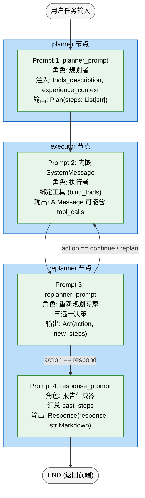
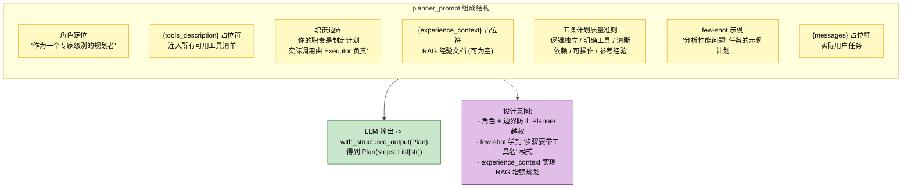
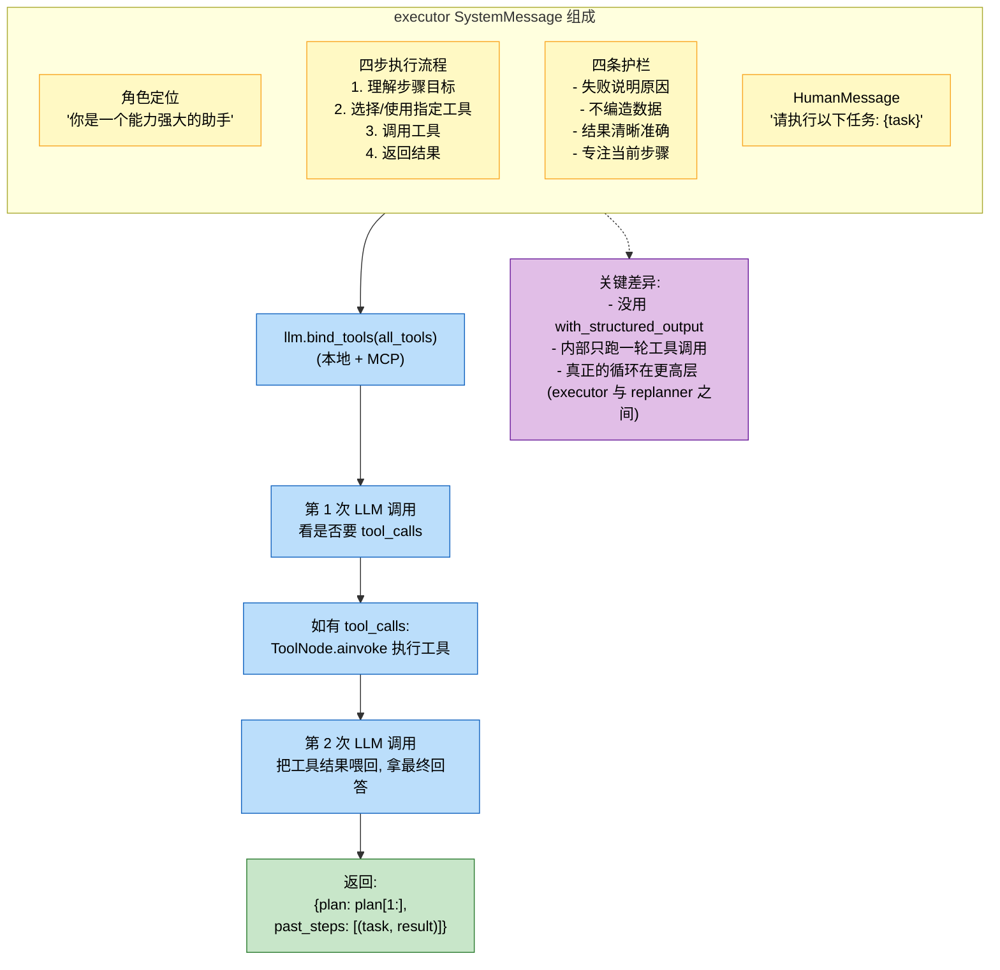
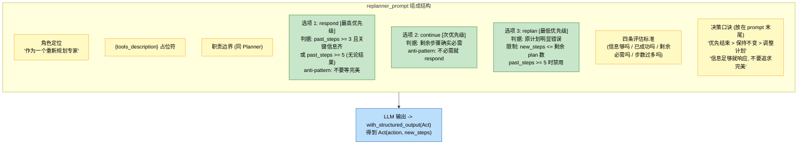
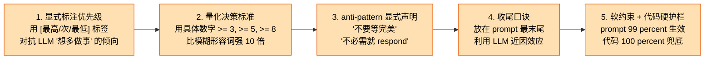
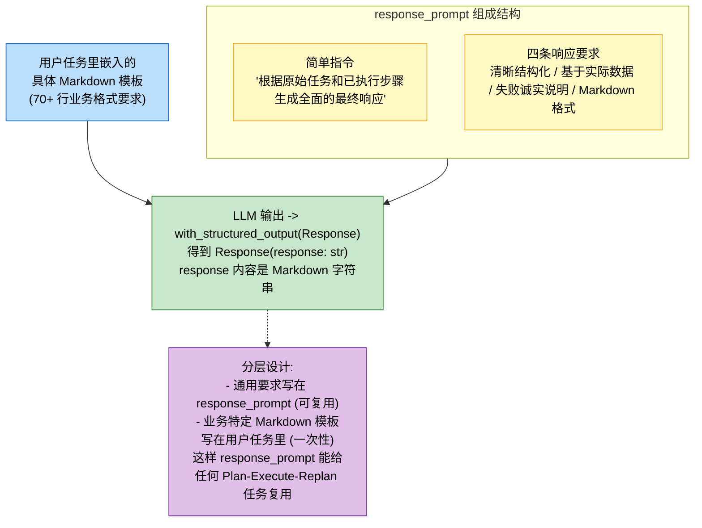
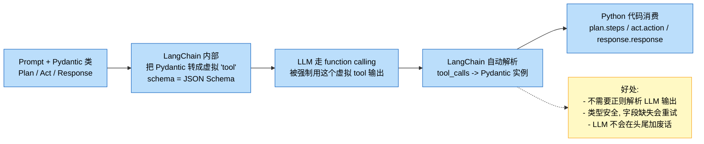
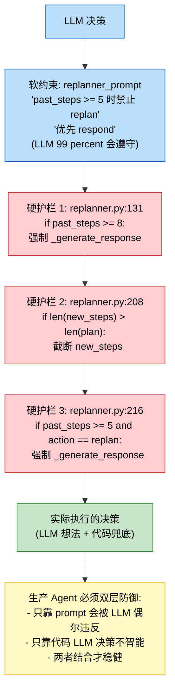
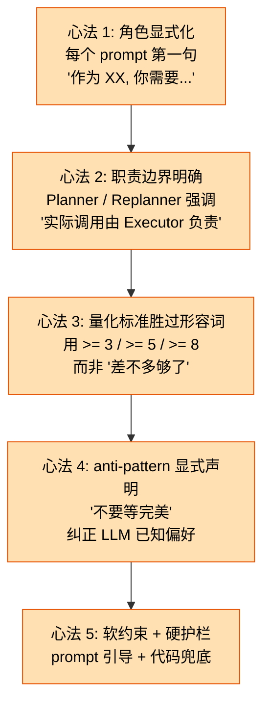

# AIOps 四个 Prompt 设计笔记

> 本文档基于 `app/agent/aiops/planner.py`、`executor.py`、`replanner.py` 实际代码绘制。
> 所有图均使用 **Mermaid** 语法,VSCode / GitHub / Typora 均可预览。
> ⚠️ Typora (Mermaid 9.1.2) 兼容性要点见文末。

---

## 1. 四个 Prompt 在状态图中的位置



**对应代码:**
- Prompt 1: `app/agent/aiops/planner.py:28-60`
- Prompt 2: `app/agent/aiops/executor.py:61-76` (SystemMessage 内嵌)
- Prompt 3: `app/agent/aiops/replanner.py:41-89`
- Prompt 4: `app/agent/aiops/replanner.py:91-108`

---

## 2. Planner Prompt 解剖



### Pydantic 输出契约

```python
class Plan(BaseModel):
    steps: List[str] = Field(
        description="完成任务所需的不同步骤..."
    )
```

---

## 3. Executor Prompt 解剖



---

## 4. Replanner Prompt 解剖 (最复杂)



### 这个 Prompt 的 5 个精彩设计



### Pydantic 输出契约

```python
class Act(BaseModel):
    action: str  # 'continue' | 'replan' | 'respond'
    new_steps: List[str]  # 仅 replan 时使用
```

---

## 5. Response Prompt 解剖 (最简短)



---

## 6. with_structured_output 工作原理



---

## 7. 软约束 (Prompt) vs 硬护栏 (代码) 双层防御



---

## 8. Prompt 设计 5 条心法 (写好任何多步 Agent 的通用准则)



---

## 9. 四个 Prompt 对比表

| 维度 | Planner | Executor | Replanner | Response |
|---|---|---|---|---|
| **代码位置** | `planner.py:28-60` | `executor.py:61-76` | `replanner.py:41-89` | `replanner.py:91-108` |
| **实现形式** | `ChatPromptTemplate` | 内嵌 `SystemMessage` | `ChatPromptTemplate` | `ChatPromptTemplate` |
| **结构化输出** | `Plan` | 无 (开放对话) | `Act` | `Response` |
| **绑工具** | 否 | 是 (`bind_tools`) | 否 | 否 |
| **复杂度** | 中等 | 简单 | 高 (有决策树) | 极简 |
| **调用次数** | 每任务 1 次 | 每步 1-2 次 | 每步 1 次 | 每任务 1 次 (终态) |

---

## 10. 编辑提示

| 想改什么 | 改哪里 |
|---|---|
| 角色风格 (改 Agent 个性) | 第 2/3/4/5 节对应 ROLE 节点 + 同步代码 |
| 质量准则 / 评估标准 | 第 4 节 CRITERIA 节点 + replanner.py |
| 优先级数字阈值 (3/5/8) | 第 4 节 OPT1/OPT2/OPT3 + replanner.py:130-218 |
| 加新决策选项 (如 rollback) | 第 4 节加 OPT4 + Act schema 改 + 状态图改 |
| 改业务报告模板 | 第 5 节 USER_TASK 节点 + aiops_service.py:174 |

Mermaid 语法参考: <https://mermaid.js.org/intro/>

---

## Typora (Mermaid 9.1.2) 兼容性要点

- 节点文本含中文/特殊符号 (`?`, `>=`, 冒号, 括号) 必须用双引号包裹
- 不要使用 Unicode 圈数字 `①②` 或箭头 `→ ≥ ←`,改成 ASCII (`>= -> 1 2`)
- 不要在 `classDiagram` 用多行 `note for`
- `**bold**` 在 9.1.2 不渲染但不报错, 显示原文 (本文档已避免使用)
- 边标签含中文一律用 `-->|"标签"|` 形式包双引号

---

## 附: 关键代码文件对应

| 文件 | 在图中的位置 |
|---|---|
| `app/agent/aiops/planner.py` | 第 1 节 P1, 第 2 节 |
| `app/agent/aiops/executor.py` | 第 1 节 P2, 第 3 节 |
| `app/agent/aiops/replanner.py` (replanner_prompt) | 第 1 节 P3, 第 4 节, 第 7 节 |
| `app/agent/aiops/replanner.py` (response_prompt) | 第 1 节 P4, 第 5 节 |
| `app/services/aiops_service.py` (diagnose 任务模板) | 第 5 节 USER_TASK |
