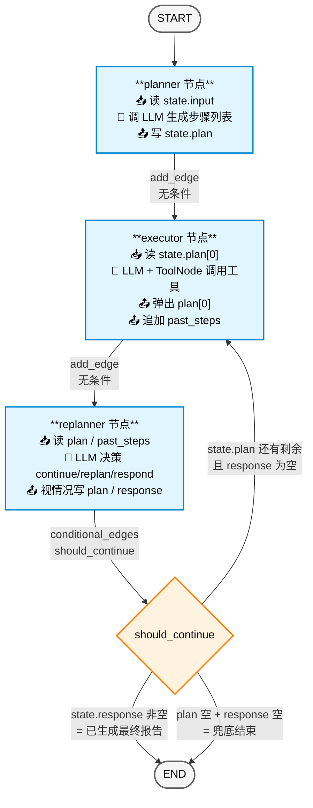
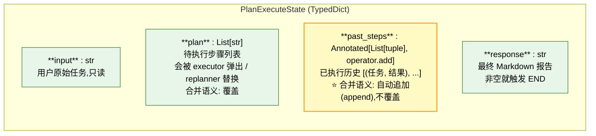
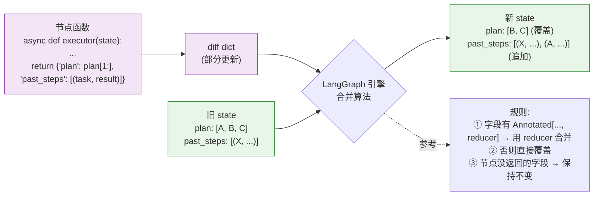
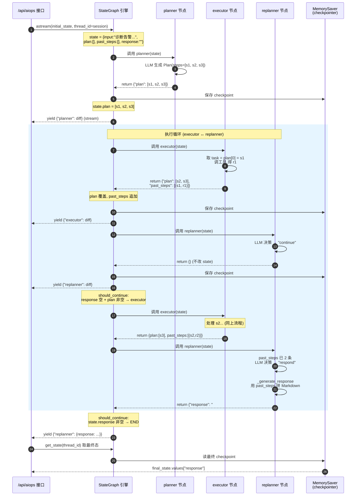
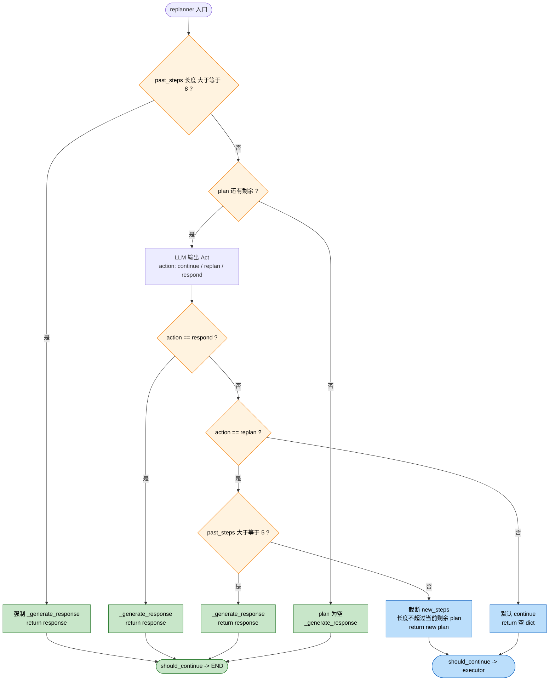
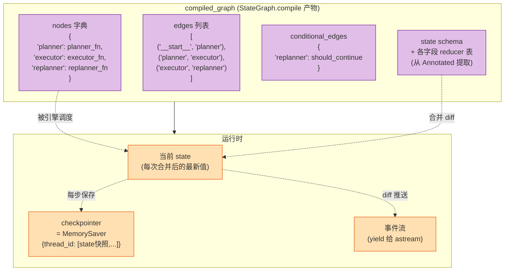
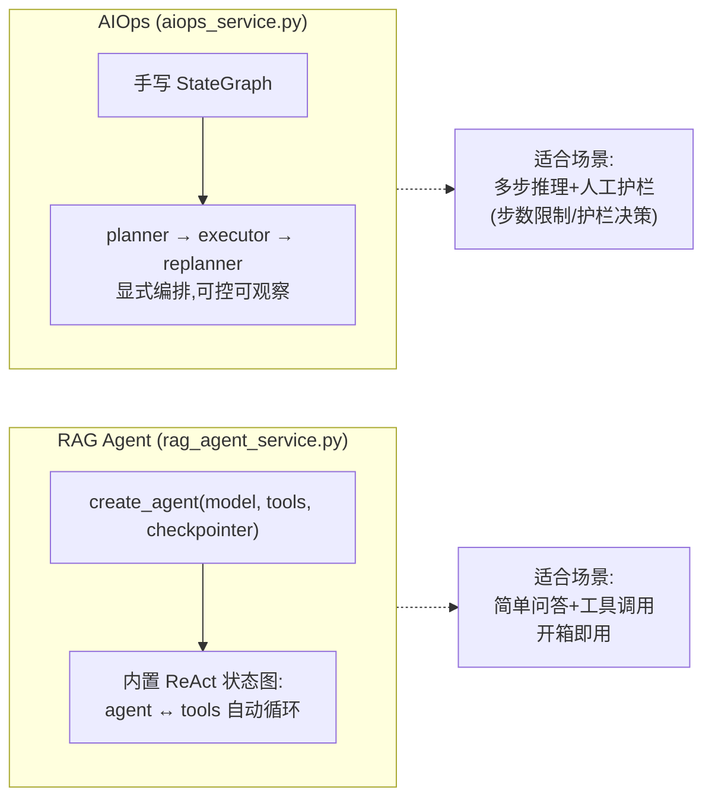

# LangGraph 状态图笔记 - AIOps Plan-Execute-Replan

> 本文档基于项目 `app/services/aiops_service.py` 和 `app/agent/aiops/` 实际代码绘制。
> 所有图均使用 **Mermaid** 语法,可在 VSCode (装 Markdown Preview Mermaid Support 插件) /
> GitHub / Typora 中直接预览,文字想改直接改即可。

---

## 1. 状态图总览(节点 + 边 + 路由)

**对应代码位置:**
- 图骨架: `app/services/aiops_service.py::_build_graph` (29-79 行)
- 路由函数: `should_continue` (49-64 行)

---

## 2. State 数据结构(共享黑板)

**对应代码:** `app/agent/aiops/state.py`

### 字段读写矩阵

| 字段 | planner | executor | replanner | 合并语义 |
|---|:---:|:---:|:---:|---|
| `input` | 读 | - | 读 | 覆盖(初始化时写) |
| `plan` | **写** | 读+**写** | 读+**写** | 覆盖 |
| `past_steps` | - | **写(追加)** | 读 | **追加(operator.add)** |
| `response` | - | - | **写** | 覆盖 |

---

## 3. 节点返回值 → 状态合并(Reducer 机制)

---

## 4. 一次完整执行的状态时序(以"诊断告警"任务为例)

---

## 5. Replanner 三选一决策树(细节)

**对应代码:** `app/agent/aiops/replanner.py::replanner` (111-239 行)

**关键护栏(防止 LLM 把循环开飞):**
- 总步数 ≥ 8 → 强制收尾
- 已执行 ≥ 5 步时 → 禁止 replan,只能 respond
- replan 的 `new_steps` 数量必须 ≤ 当前剩余步骤数(否则截断)

---

## 6. StateGraph 编译产物的运行时结构

---

## 7. 与 RAG Agent (`create_agent`) 的对比

---

## 8. 编辑提示

如果你要改这个图谱:

| 想改什么 | 改哪里 |
|---|---|
| 新增一个节点(比如加 verifier) | 第 1 节 flowchart 加一个方块,加一条 add_edge |
| 字段含义变化 | 第 2 节 classDiagram 里改 note |
| 决策逻辑增减分支 | 第 5 节 flowchart 加判断节点 |
| 改护栏数字(MAX_STEPS / 5 步上限) | 第 5 节文字描述 + replanner.py 同步 |

Mermaid 完整语法参考: <https://mermaid.js.org/intro/>

---

## 附:每个文件对应到图的哪部分

| 文件 | 在图中的位置 |
|---|---|
| `app/agent/aiops/state.py` | 第 2 节 State 类图 |
| `app/agent/aiops/planner.py` | 第 1 节 PLANNER 节点 |
| `app/agent/aiops/executor.py` | 第 1 节 EXECUTOR 节点 |
| `app/agent/aiops/replanner.py` | 第 1 节 REPLANNER + 第 5 节决策树 |
| `app/services/aiops_service.py` | 第 1 节图骨架 + 第 4 节时序 + 第 6 节运行时 |
