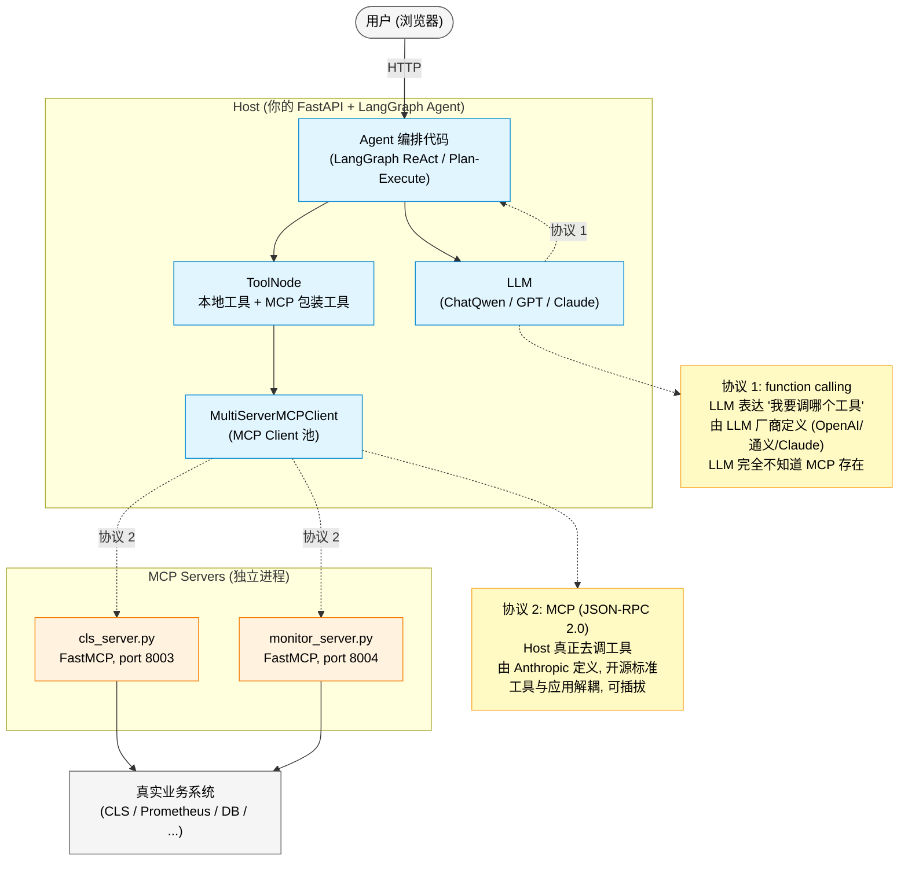
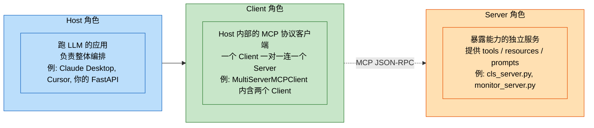
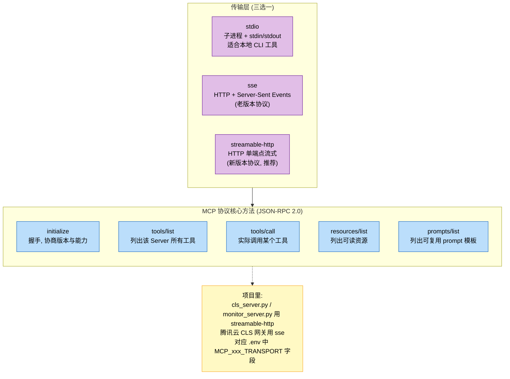
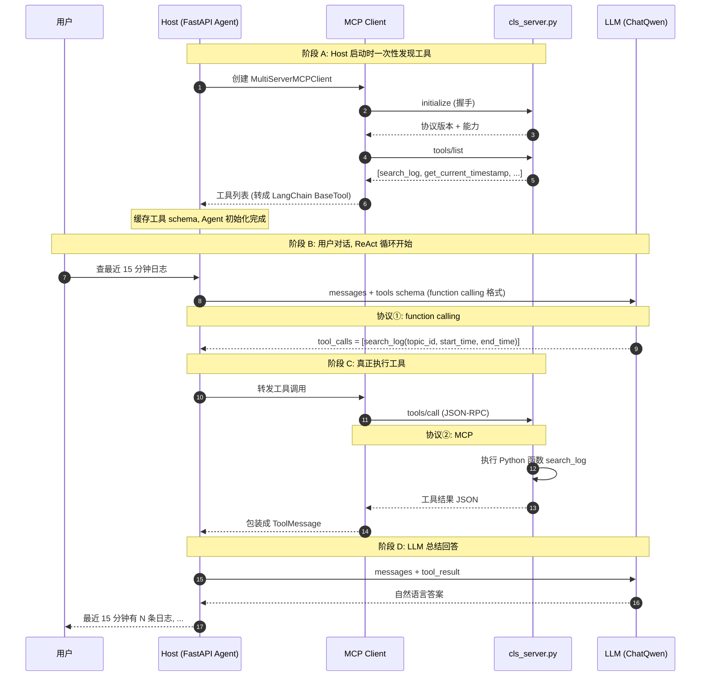
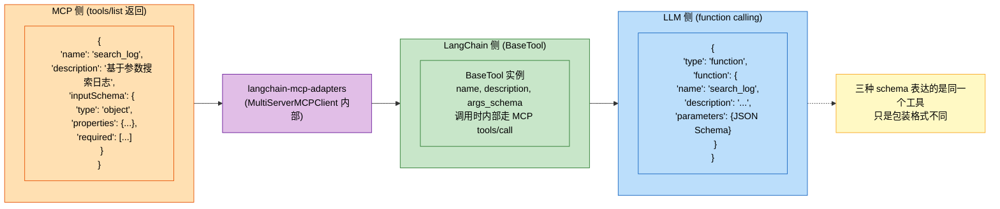
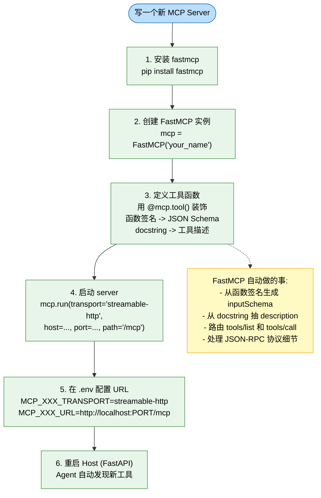
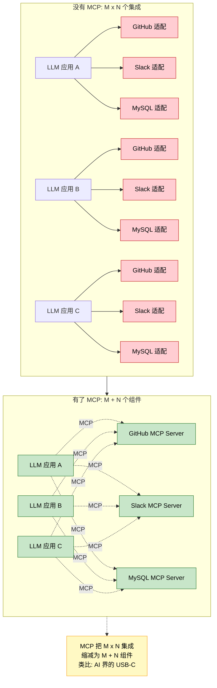
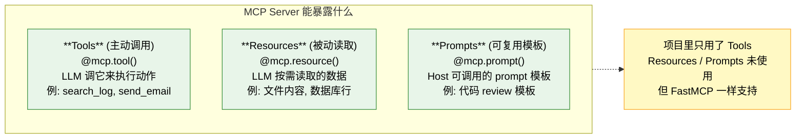
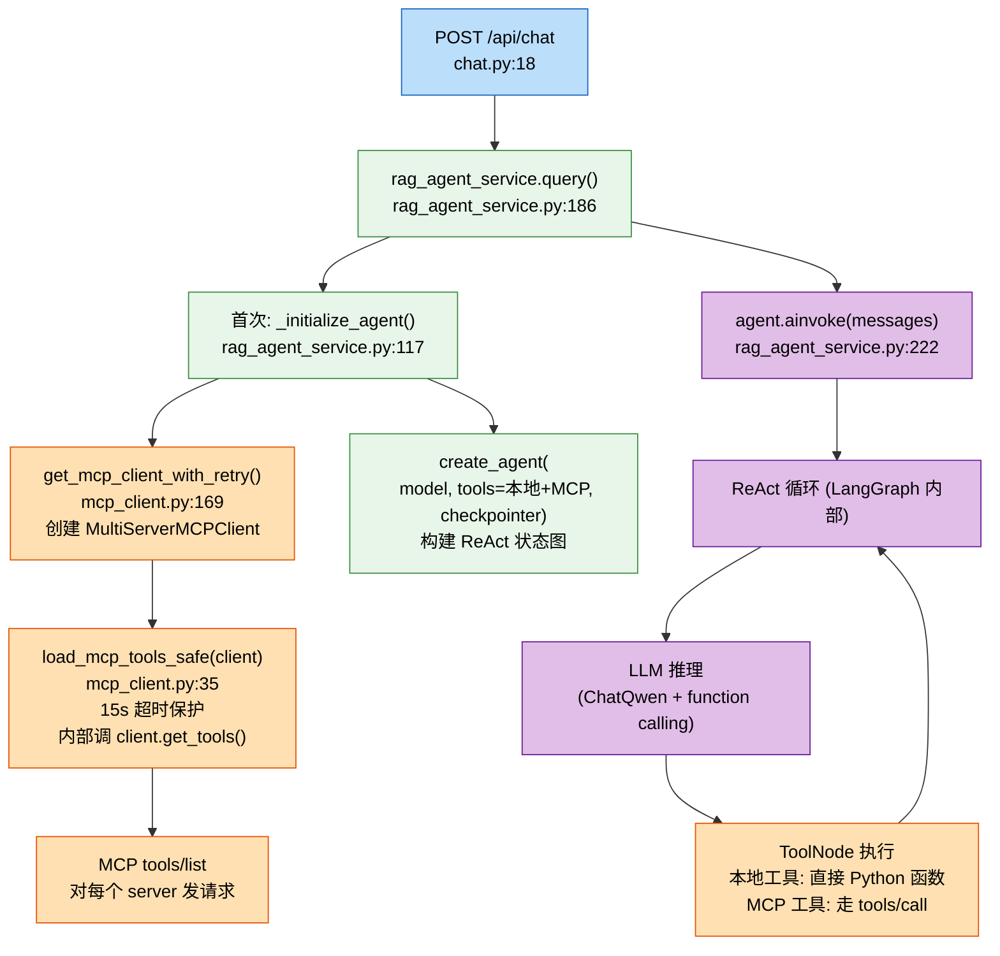

# MCP 协议笔记 - 从认知模型到项目实践

> 本文档基于项目 `mcp_servers/` 和 `app/agent/mcp_client.py` 实际代码绘制。
> 所有图均使用 **Mermaid** 语法,VSCode / GitHub / Typora 均可预览。
> ⚠️ 编辑时若 Typora (Mermaid 9.1.2) 报错,所有含中文/特殊符号的节点文本一律用双引号包裹。

---

## 1. 大局图: 两层协议的清晰分工



**记住三句话:**
- function calling 是 **LLM ↔ Host** 之间的协议, 跟 MCP 无关
- MCP 是 **Host ↔ Tool Server** 之间的协议, LLM 完全无感
- MCP Client 在中间做的是 **格式翻译**, 不是 LLM 直接说 MCP

---

## 2. MCP 的三个角色



| 角色 | 在你项目里 | 关键代码 |
|---|---|---|
| Host | 整个 FastAPI 服务 | `app/main.py` |
| Client | `MultiServerMCPClient` 实例 | `app/agent/mcp_client.py` |
| Server | 独立 Python 进程 | `mcp_servers/cls_server.py`, `monitor_server.py` |

---

## 3. 传输层与协议方法



### JSON-RPC 消息样例

`tools/call` 请求:

```json
{
  "jsonrpc": "2.0",
  "id": 42,
  "method": "tools/call",
  "params": {
    "name": "search_log",
    "arguments": {
      "topic_id": "topic-001",
      "start_time": 1708011445000,
      "end_time": 1708012345000
    }
  }
}
```

响应:

```json
{
  "jsonrpc": "2.0",
  "id": 42,
  "result": {
    "content": [{"type": "text", "text": "{...日志结果...}"}]
  }
}
```

---

## 4. 一次完整调用的时序图

> 假设用户问: "查最近 15 分钟 data-sync-service 的日志"



**关键观察:**
- 阶段 A 只在启动时跑一次, 之后工具列表被缓存
- 阶段 B 是 **function calling**, 阶段 C 是 **MCP**
- LLM 不知道 server 在哪, 它只看到一份工具 schema

---

## 5. function calling 与 MCP 的格式翻译



---

## 6. 自己写一个 MCP Server (FastMCP 极简范式)



### 最小可运行示例

```python
# mcp_servers/weather_server.py
from fastmcp import FastMCP

mcp = FastMCP("Weather")

@mcp.tool()
def get_weather(city: str) -> dict:
    """查询某城市天气

    Args:
        city: 城市名, 如 北京
    Returns:
        包含 temperature 和 condition 的字典
    """
    fake = {"北京": {"temperature": 22, "condition": "晴"}}
    return fake.get(city, {"error": f"未知城市: {city}"})

if __name__ == "__main__":
    mcp.run(transport="streamable-http",
            host="127.0.0.1", port=8005, path="/mcp")
```

启动: `python mcp_servers/weather_server.py`

`.env` 加配置:
```
MCP_WEATHER_TRANSPORT=streamable-http
MCP_WEATHER_URL=http://localhost:8005/mcp
```

⚠️ 注意: `app/config.py` 的 `mcp_servers` 属性写死了 CLS / Monitor 两个 server, 加新 server 还需在 config 里加一份。

---

## 7. M×N 问题 (MCP 为什么被发明)



---

## 8. MCP 能暴露的三种能力



---

## 9. 在项目里实际数据流 (代码级追踪)



---

## 10. 编辑提示

| 想改什么 | 改哪里 |
|---|---|
| 加一个新 MCP Server | 第 1 节大局图 SERVERS subgraph 加一个节点 |
| 改某个 server 的端口/transport | 第 3 节 PROJ_NOTE 内容 |
| 新增工具的发现/调用流程 | 第 4 节时序图加 participant 与消息 |
| 协议方法变化 (新版 MCP 增加方法) | 第 3 节 METHODS subgraph 加节点 |
| 想画 Resources / Prompts 用法 | 第 8 节扩展为具体例子 |

Mermaid 语法参考: <https://mermaid.js.org/intro/>

Typora (Mermaid 9.1.2) 兼容性要点:
- 节点文本含中文/特殊符号 (`?`, `>=`, 冒号, 括号) 必须用双引号包裹
- 不要在 classDiagram 用多行 note for
- `**bold**` 在 9.1.2 不渲染但不报错, 显示原文
- 中文标点 (`、` `。`) 安全, 但 `→` `≥` 在未加引号时报词法错误

---

## 附: 关键代码文件对应

| 文件 | 在图中的位置 |
|---|---|
| `mcp_servers/cls_server.py` | 第 1 节 SERVERS, 第 6 节范式 |
| `mcp_servers/monitor_server.py` | 第 1 节 SERVERS |
| `app/agent/mcp_client.py` | 第 1 节 MCPCLIENT, 第 9 节流程 |
| `app/services/rag_agent_service.py` | 第 9 节代码追踪 |
| `app/config.py` (mcp_servers 属性) | 第 6 节注意事项 |
| `.env` (MCP_xxx_TRANSPORT/URL) | 第 3 节 PROJ_NOTE |
