# Milvus RAG 选型笔记 - Chunk / Embedding / 索引

> 本文档基于项目 `app/services/document_splitter_service.py`、`vector_embedding_service.py`、
> `vector_store_manager.py`、`app/core/milvus_client.py` 实际代码绘制。
> 所有图均使用 **Mermaid** 语法,VSCode / GitHub / Typora 均可预览。
> ⚠️ Typora (Mermaid 9.1.2) 兼容性要点见文末。

---

## 1. 完整 RAG 流程总览

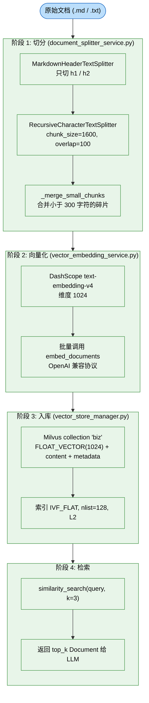

**对应代码:**
- 切分: `app/services/document_splitter_service.py`
- 向量化: `app/services/vector_embedding_service.py`
- 入库: `app/services/vector_store_manager.py`
- 索引创建: `app/core/milvus_client.py:192-208`

---

## 2. Chunk 切分策略 (三阶段 + 设计意图)

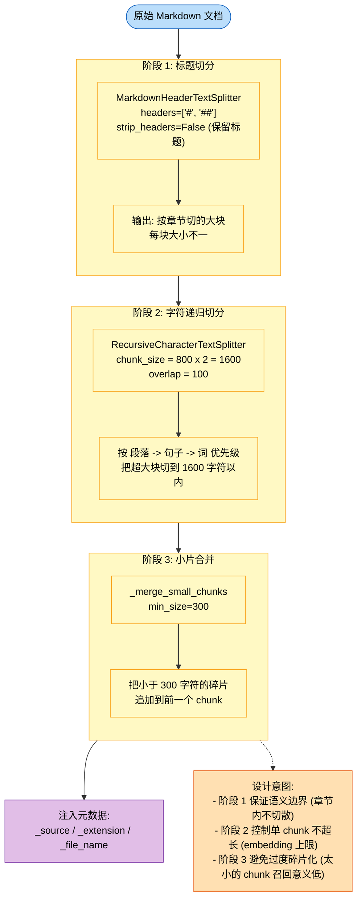

### chunk_size / overlap 选择权衡

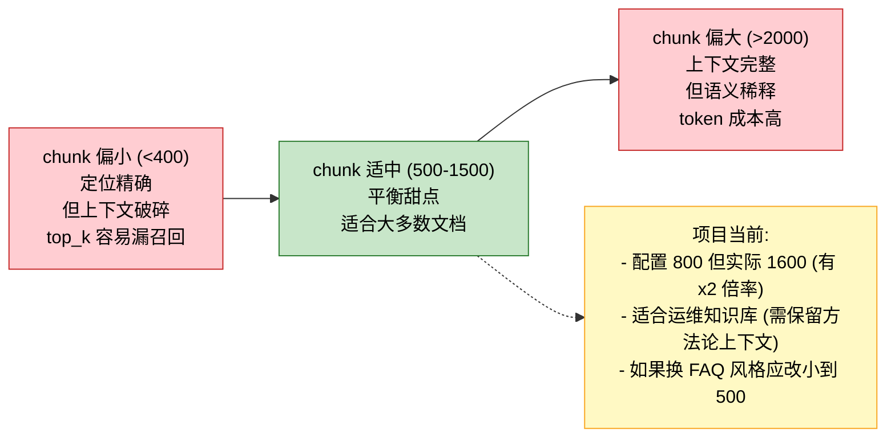

---

## 3. Embedding 模型选型

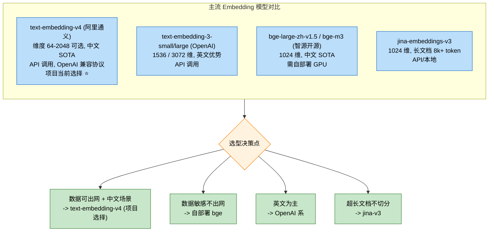

---

## 4. 三大不可变决策 (一旦上线很难改)

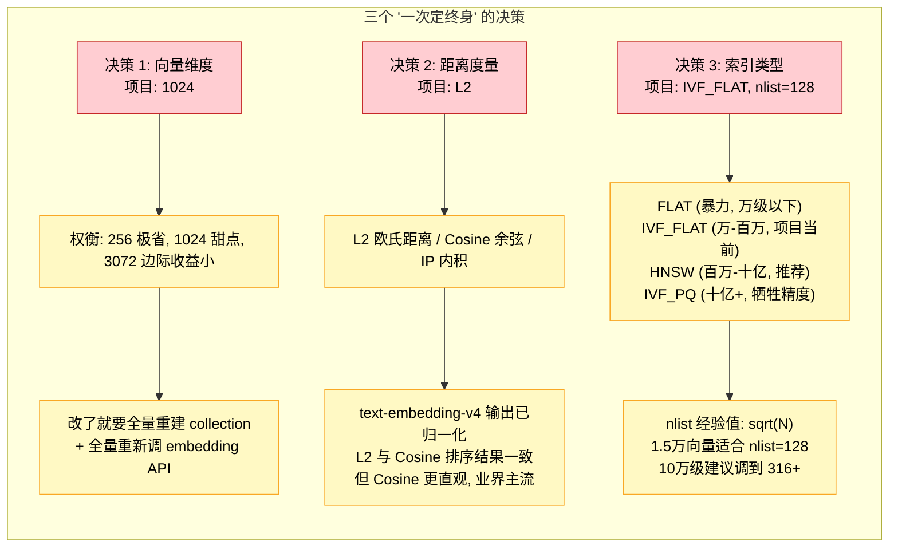

### 自动重建机制 (项目里的防呆设计)

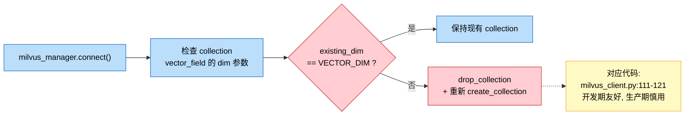

---

## 5. Collection Schema 设计

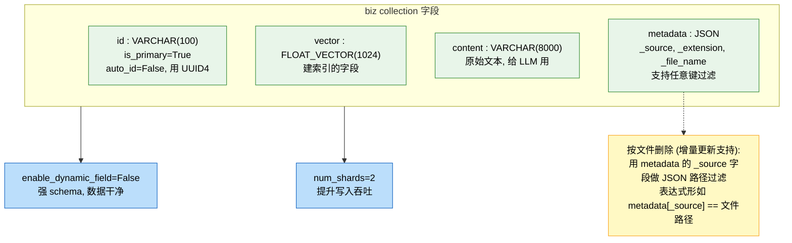

---

## 6. 索引参数详解 (IVF_FLAT)

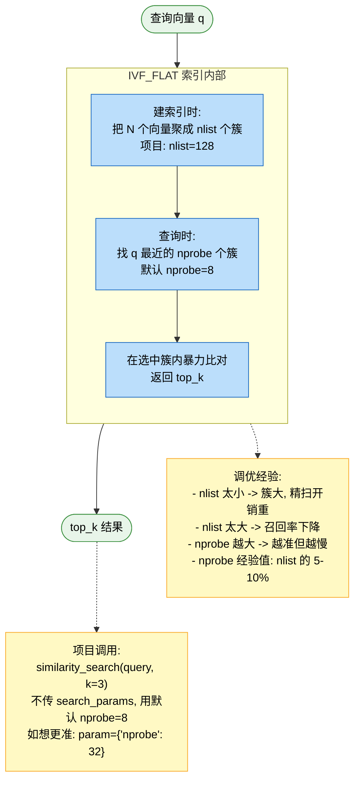

---

## 7. top_k 权衡

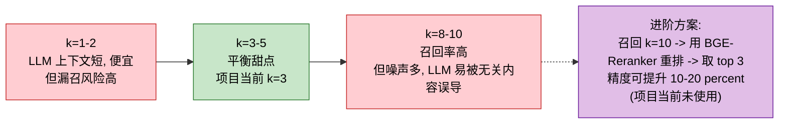

---

## 8. 项目当前选型评估 + 优化建议矩阵

```mermaid
flowchart TB
    subgraph GOOD["做得好的地方"]
        direction TB
        G1["Markdown 两阶段切分 + 合并小片"]
        G2["维度变化自动重建 collection"]
        G3["元数据带 _source 支持按文件删除"]
        G4["auto_id=False + UUID 可控主键"]
        G5["enable_dynamic_field=False 强 schema"]
    end

    subgraph IMPROVE["可优化点 (按重要性排序)"]
        direction TB
        I1["1. metric_type: L2 -> COSINE<br/>业界主流, 日志直观"]
        I2["2. overlap: 100 (6 percent) -> 200 (12 percent)<br/>中文长句容易被切断"]
        I3["3. 加入 BGE-Reranker<br/>k=10 召回 + rerank -> 3"]
        I4["4. index_type: IVF_FLAT -> HNSW<br/>中等规模下精度更高"]
        I5["5. chunk_size 配置歧义<br/>声明 800 实际 1600, 改成直接 1600"]
    end

    classDef good fill:#c8e6c9,stroke:#2e7d32,color:#000
    classDef tip fill:#ffe0b2,stroke:#e65100,color:#000
    class G1,G2,G3,G4,G5 good
    class I1,I2,I3,I4,I5 tip
```

---

## 9. 心法总结

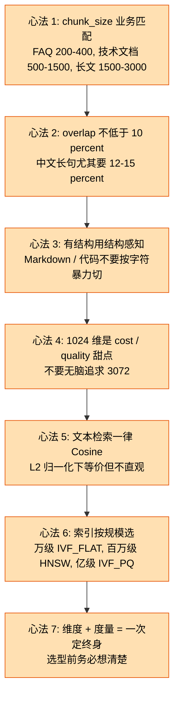

---

## 10. 编辑提示

| 想改什么 | 改哪里 |
|---|---|
| 换 embedding 模型 | 第 3 节 + `vector_embedding_service.py:23-25` + 维度同步改 |
| 改向量维度 | 第 4 节 D1 + `milvus_client.py:49` (会触发自动重建) |
| 改距离度量 | 第 4 节 D2 + `milvus_client.py:198` |
| 改索引类型 (IVF_FLAT -> HNSW) | 第 6 节 + `milvus_client.py:197-201` |
| 改 chunk_size / overlap | 第 2 节 + `app/config.py:43-44` |
| 改 top_k | 第 7 节 + `app/config.py:39` |
| 加 reranker | 第 7 节 UPGRADE 节点扩展为新章节 |

Mermaid 语法参考: <https://mermaid.js.org/intro/>

---

## Typora (Mermaid 9.1.2) 兼容性要点

- 节点文本含中文/特殊符号 (`?`, `>=`, 冒号, 括号) 必须用双引号包裹
- 不要使用 Unicode 圈数字 `①②` 或箭头 `→ ≥ ←`,改成 ASCII (`>= -> 1 2`)
- 不要在 `classDiagram` 用多行 `note for`
- 不要用 Mermaid 保留字做 classDef 名:`call` `click` `end` `style` `class` `href`
- 边标签含中文一律用 `-->|"标签"|` 形式包双引号
- **节点文本里不能用反斜杠转义引号** `\"`,Mermaid 9.1.2 不识别。代码片段建议放节点外的 `\`\`\`` 代码块,节点里只做描述

---

## 附: 关键代码文件对应

| 文件 | 在图中的位置 |
|---|---|
| `app/services/document_splitter_service.py` | 第 1 节 SPLIT, 第 2 节三阶段 |
| `app/services/vector_embedding_service.py` | 第 1 节 EMBED, 第 3 节模型选型 |
| `app/services/vector_store_manager.py` | 第 1 节 STORE, 第 5 节 schema |
| `app/core/milvus_client.py` | 第 4 节三大决策, 第 5 节 schema, 第 6 节索引 |
| `app/config.py` (chunk / top_k) | 第 2 节 chunk, 第 7 节 top_k |
